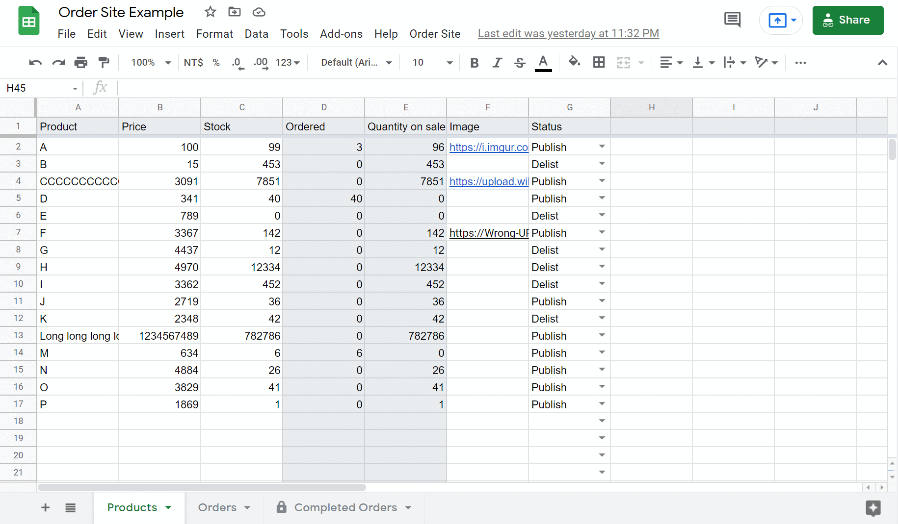

## Order Site

A small but complete ordering website.

## DEMO

Welcome to do any test.

-   Front end: [https://hsin19.github.io/orderSite](https://hsin19.github.io/orderSite)
-   Back end: [Google Sheets](https://docs.google.com/spreadsheets/d/1FVqxeygKUQh3-hr0ESbJOhcVo_mYfj1L07dclFuizUs/edit#gid=1734984684)

## Features

### Use google Sheets, No Server Required!

### Responsive Web Design

## Built With

-   vanilla javascript
-   [Google Apps Script](https://developers.google.com/apps-script)
-   [Bootstrap 5](https://getbootstrap.com)

## How to Build

There are two parts that need to be built: Google sheets and front end

### Google Sheets

1. Create a empty [Google Sheets](https://docs.google.com/spreadsheets)
2. Tools > Script editor
3. Add all script and html from [folder GoogleAppsScript](GoogleAppsScript)
4. Deploy Web app and record the web app URL
5. Go back to google sheets and reorganize. The menu bar will have a new item `Order Site`, and then select `Create System` and the system will automatically build.

### Front End

1.  Host all file in [folder docs](docs > Recommended platform: Netlify, github page, etc.
    . Host all file in [folder docs](docs > Recommended platform: Netlify, github page, etc.
2.  Edit setting.json
    -   url: [web app URL](#url)
        > https://script.google.com/macros/s/YOUR_Deployment_ID/exec
    -   brand(Optional): Website Name
    -   title(Optional): Website Title Tag
3.  (Optional)Modify the favicon.ico, img/logo.png.
4.  (Optional)Modify html such as contact information, footer , etc.

## How to Use

### Back End (Google Sheets)

_If you are not sure what you are doing, please do not edit when the warning pops out._

There are three main pages:

-   Products: Change product information here, please use url for pictures.
-   Orders: When the order is received on the web, it will be displayed here. In principle, only the status field needs to be changed.
-   Completed Orders: viewing only, List of completed orders.

If you change the status but block the confirmation, you can press the **menu bar > Order Site > Check System** to check again.

### Front End

I think you can use it without instructions!

## Contact Me

葉信賢 Eric - eric91343@gmail.com
